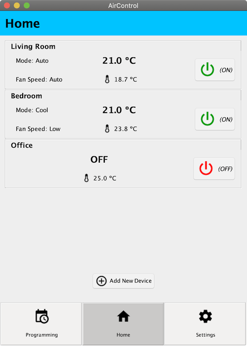
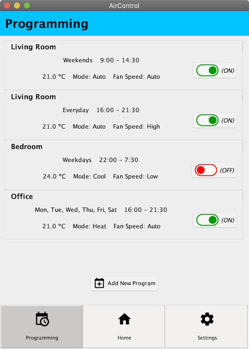
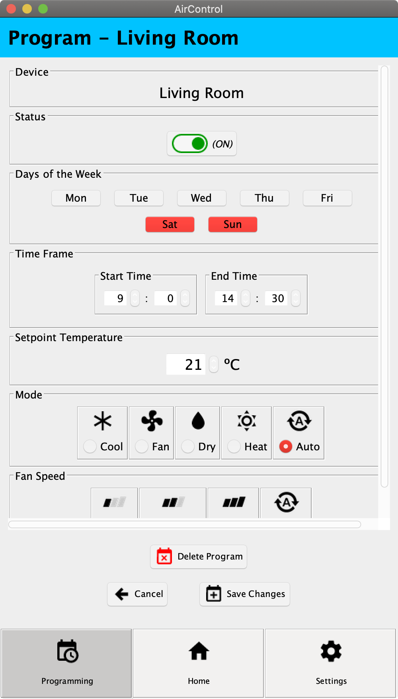
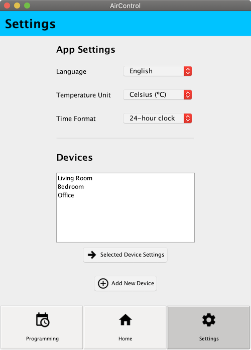
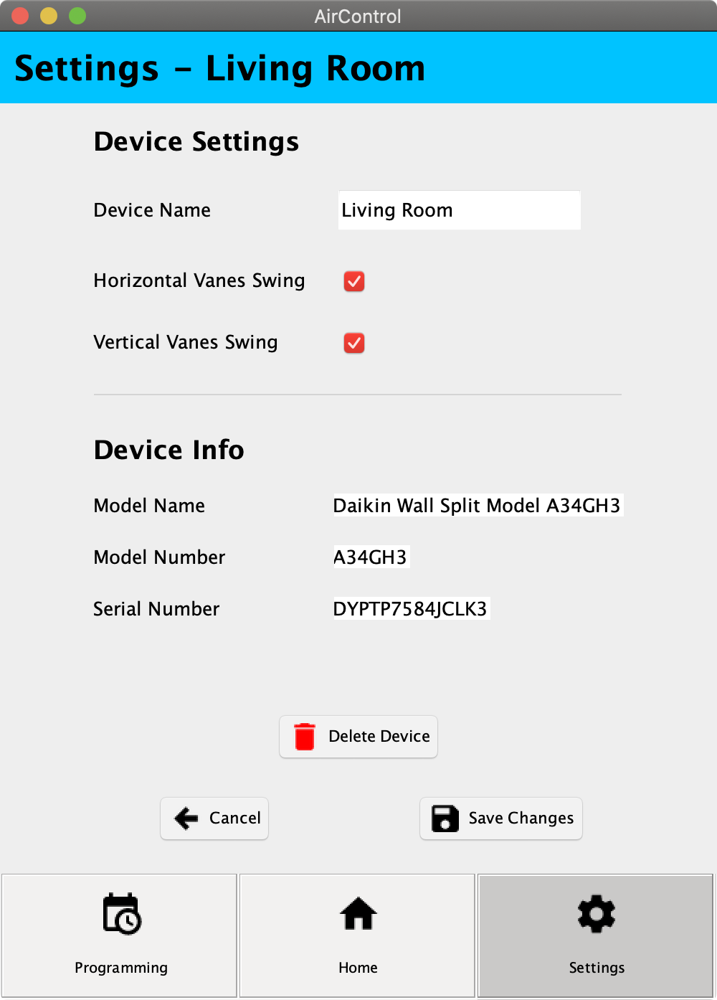

# AirControl Java Swing App Interface

**Final Project for Interactive Systems course.**

Interface of a mobile app to control air conditioning systems implemented with Java Swing.

The prototype of the interface made with Pencil Project is available [here](http://www.uco.es/users/i52salia/si/trabajo/clickable-html-prototype/#s0_home_page). It actually came out pretty similar :D

## Authors

* Andrés Salinas Lima

## Screenshots

