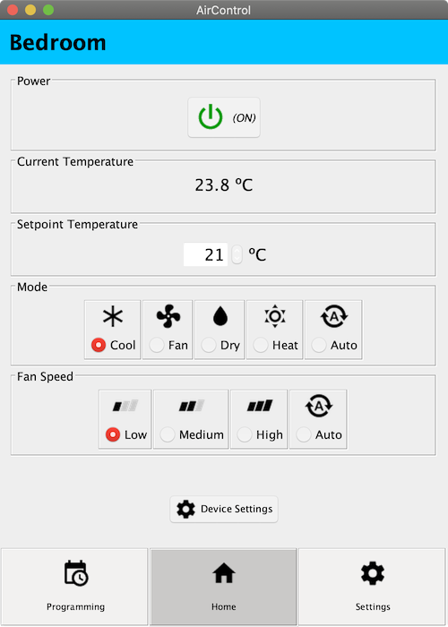
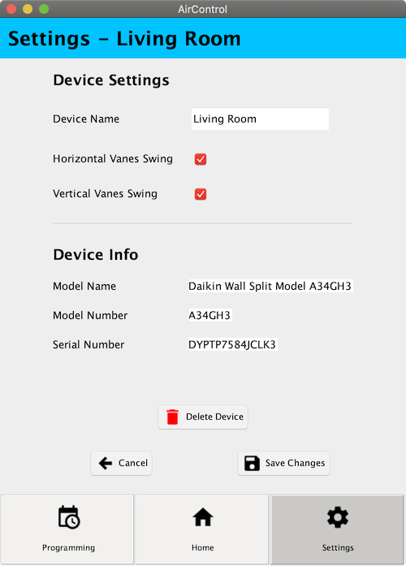

# AirControl Java Swing App Interface

**Final Project for the Interactive Systems course.**

Interface of a mobile app to control air conditioning systems implemented with Java Swing.

Various prototypes of the interface were made prior to implementation using [Pencil Project](https://pencil.evolus.vn). The final one is available [here](https://andressalinas97.github.io/AirControl-Java-Swing-App-Interface/pencil-prototype/#s0_home_page). It actually came out pretty similar :D

## Authors

* Andrés Salinas Lima

## Getting Started

The `AirControl.jar` is available in [releases](https://github.com/AndresSalinas97/AirControl-Java-Swing-App-Interface/releases) and ready to be played with.

This project was created using NetBeans IDE 8. You can import the project and start working on it or simply compile and run it like any other Java project (the main class is in `i52salia.aircontrol.AirControl`).

## Screenshots

